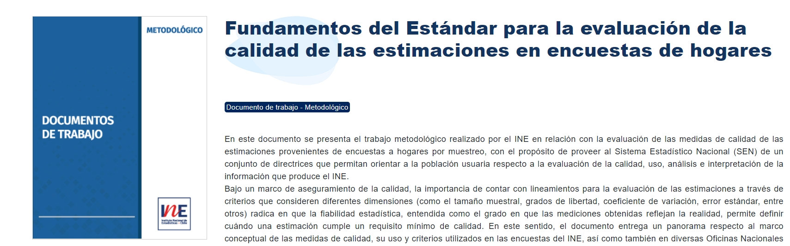
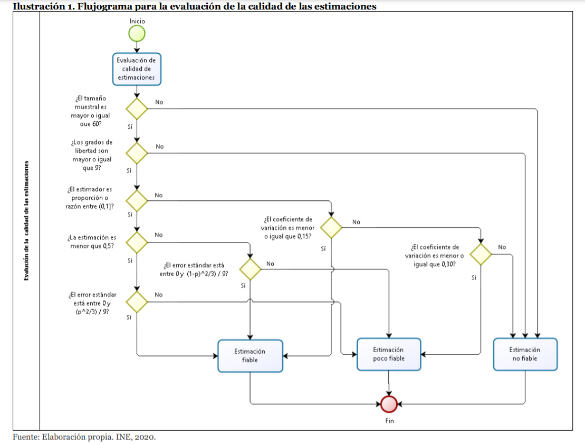
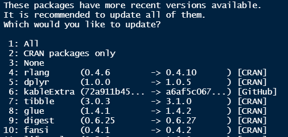

class: center, middle

.linea-superior[]
.linea-inferior[]


## Capacitación en uso paquete calidad para 
Subsecretaría prevención del delito

## Subdepartamento condiciones de vida 
**INE**

### Diciembre 2021

```{r setup, include=FALSE}
options(htmltools.dir.version = TRUE)
knitr::opts_chunk$set(message = FALSE, warning = F) 
options(scipen = "999")
```

```{r xaringan-themer, include=FALSE, warning=FALSE}
library(xaringanthemer)
```

---

background-image: url("imagenes/fondo2.PNG")
background-size: contain;
background-position: 100% 0%

# Estructura del taller


- Breve repaso del estándar de calidad para las estimaciones en encuestas de hogares del INE

--

- Recordar de manera general el paquete `survey`

--

- Presentación y ejercicios prácticos con el paquete `calidad`, desarrollado por el PE SSCC. 

--

**Objetivo del taller**

- Presentar principales funciones del paquete de `calidad` para la implementación del estandar de calidad porpuesto por el INE, con datos de ENUSC.

--

### Asumiremos un conocimiento básico de R

---

background-image: url("imagenes/fondo2.PNG")
background-size: contain;
background-position: 100% 0%

# Estándar de calidad INE

Desde 2020, el INE cuenta con un [estándar](https://www.ine.cl/docs/default-source/documentos-de-trabajo/20200318-lineamientos-medidas-de-precisi%C3%B3n.pdf?sfvrsn=f1ab2dbe_4) para evaluar la calidad de estimaciones provenientes de encuestas de hogares


.center[

]

--

Nos permite determinar si una estimación es **fiable, poco fiable o no fiable** 

--

Nos orienta respecto a si un tabulado debe ser publicado o no


---
background-image: url("imagenes/fondo2.PNG")
background-size: contain;
background-position: 100% 0%

# Aspectos generales del estándar

Existe un flujo, que nos permite etiquetar **automáticamente** cada estimación 

--

.center[

]

---

background-image: url("imagenes/fondo2.PNG")
background-size: contain;
background-position: 100% 0%

# Aspectos generales del estándar

## El flujo establece caminos diferenciados

--

### Estimaciones de proporción (o razón) entre **0 y 1**

- Tamaño muestral
- Grados de libertad
- .red[Error estándar] 

--

### Resto de estimaciones

- Tamaño muestral
- Grados de libertad
- .red[Coeficiente de variación] 
 

### En un caso usamos el SE y en otro el CV

---

background-image: url("imagenes/fondo2.PNG")
background-size: contain;
background-position: 100% 0%

# Introducción paquete calidad

### ¿Cómo pasar del documento a la práctica?

.center[

]

--

Existen múltiples herramientas (Stata, R, SAS, Python) y todas son válidas

--

Múltiples modalidades dentro de cada herramienta (libertad total, scripts estandarizados, funciones, etc)

--

Es útil contar con una herramienta que **estandarice** los criterios de calidad


---

background-image: url("imagenes/fondo2.PNG")
background-size: contain;
background-position: 100% 0%

# Introducción paquete calidad

Una posibilidad es el uso de un **paquete (librería)**

--

El paquete `calidad` implementa el estándar mediante `R`

--

### Objetivos del paquete

- Facilitar la aplicación del estándar a usuarios externos
- Aumentar la eficiencia en el trabajo de los analistas
- Reducir la probabilidad de error en la implementación

--

El paquete `calidad` combina el estándar del INE con el paquete `survey`, desarrollado por Thomas Lumley


.center[

]

--

.center[
### Revisaremos velozmente el paquete survey
]


---

background-image: url("imagenes/fondo2.PNG")
background-size: contain;
background-position: 100% 0%

# Brevísima revisión de survey

Usaremos los datos de ENUSC 2020 y 2019


```{r}
library(readr)
library(tidyverse)

# enusc <- haven::read_sav("base-de-datos---xvi-enusc-2019.sav")
enusc <- feather::read_feather("data/enusc2019.feather")

```
--

Construyamos variables necesarias para hacer algunos cálculos

```{r}
### Seleccionamos a los casos kish 
enusc = enusc[enusc$Kish == 1,]

### percepción de inseguridad por sexo
enusc = enusc %>%  mutate(muj_insg_taxi = dplyr::if_else(enusc$P9_4_1 %in% c(1,2) & enusc$rph_sexo == 2,1 ,0),
                          hom_insg_taxi = dplyr::if_else(enusc$P9_4_1 %in% c(1,2) & enusc$rph_sexo == 1,1 ,0))

enusc$muj_insg_micro = if_else(enusc$P9_3_1 %in% c(1,2) & enusc$rph_sexo == 2,1 ,0)
enusc$hom_insg_micro = if_else(enusc$P9_3_1 %in% c(1,2) & enusc$rph_sexo == 1,1 ,0)

enusc$robo_vehiculo = if_else(enusc$G1_1_1 == 1,1,0)

```

---
background-image: url("imagenes/fondo2.PNG")
background-size: contain;
background-position: 100% 0%

# Brevísima revisión de survey

En primer lugar, declaramos el diseño complejo con la función `svydesign`
```{r}
library(survey)

### declaramos diseño complejo con el factor de personas
dcPers <- svydesign(ids = ~Conglomerado, strata = ~VarStrat,
                     data = enusc, weights = ~Fact_Pers)

### declaramos diseño complejo con el factor de hogares
dcHog <- svydesign(ids = ~Conglomerado, strata = ~VarStrat,
                     data = enusc, weights = ~Fact_Hog)


```

Debemos declarar:
- conglomerados de varianza
- estratos de varianza
- factor de expansión

--

Es importante indicarle a `survey` qué hacer cuando existen estratos que solo tienen una UPM 

```{r}
options(survey.lonely.psu = "certainty")
```


---
background-image: url("imagenes/fondo2.PNG")
background-size: contain;
background-position: 100% 0%

# Brevísima revisión de survey

### Ahora podemos usar los paquetes `survey` y  `calidad` para diferentes tipos de cálculos 😃😃😃😃😃

--

**Calculemos la Victimización Personal de Delitos Consumados**

```{r}
svymean(x = ~VP_DC,dcPers)
```
--

**Calculemos la Victimización Personal de Delitos Consumados por regiones**

```{r}
svyby(formula = ~VP_DC, design = dcPers, by = ~enc_region, FUN = svymean)
```
--

**Calculemos la inseguridad de las mujeres en taxis por sobre los hombres**

```{r, eval=F}
svyratio(numerator = ~muj_insg_taxi, denominator = ~hom_insg_taxi, dcPers)
```
---

background-image: url("imagenes/fondo2.PNG")
background-size: contain;
background-position: 100% 0%

# Brevísima revisión de survey

`survey` permite hacer una infinidad de cálculos 

- `svymean`
- `svytotal`
- `svyratio`
- `svyby`
- `svyquantile`

--

Mediante la función `as.svrepdesign` podemos, además, utilizar métodos de remuestreo

- intervalos de confianza de percentiles
- cv de percentiles

--

.center[
### El paquete survey es una gran herramienta que nos hace la vida más fácil 
]

.center[

]


---
background-image: url("imagenes/fondo2.PNG")
background-size: contain;
background-position: 100% 0%

# Instalación paquete calidad

Lo primero, es descargar el paquete desde `github`

Se requiere el paquete `devtools`

```{r, eval=F}
library(devtools)
install_github("inesscc/calidad")
```

--

### En la consola, aparecerá el siguiente mensaje


.center[

]

### Debes escribir 3 en la consola y luego enter

---
background-image: url("imagenes/fondo2.PNG")
background-size: contain;
background-position: 100% 0%

# Panorama general

Lo siguiente, es cargar el paquete en la sesión

```{r}
library(calidad)
```

El paquete `calidad` tiene 2 grandes familias de funciones:

- *create_*: permiten **crear** los insumos para el estándar
- *evaluate_*: permiten hacer la **evaluación** del estándar

--

Podemos hacer los siguientes cálculos

- `create_mean`: calcular la media (edad)
- `create_prop`: proporción o razón (VP_DC, ocupación) 
- `create_tot`: conteo de unidades (ocupación)
- `create_tot_con`: suma de variables continuas (ingreso)
- `create_median`: mediana (edad, ingreso)

--

### Estas funciones devuelven la estimación y los insumos para el estándar

---
background-image: url("imagenes/fondo2.PNG")
background-size: contain;
background-position: 100% 0%

# Panorama general

Queremos calcular la edad media para mujeres y hombres

--

```{r, eval=F}
 create_mean(var = edad_numerica, dominios = rph_sexo, disenio = dcPers)
```

- `var`: variable a estimar
- `dominios`: desagregaciones
- `disenio`: diseño muestral creado con `svydesign`

--

La función genera:
- estimación 
- error estándar (se)
- grados de libertad (gl)
- tamaño muestral (n)
- coeficiente de variación (coef_var)

---
background-image: url("imagenes/fondo2.PNG")
background-size: contain;
background-position: 100% 0%

# Panorama general

A diferencia de `survey`, en el paquete `calidad` no es necesario utilizar ~  

```{r, eval=F}
# Argumentos con paquete survey
 svyby(formula = ~rph_edad, by = ~rph_sexo, design =  dcPers, FUN = svymean) 
```


--

Tampoco se requiere que los argumentos estén escritos como *strings*

--

Sin embargo, existe la libertad para usar *strings*

```{r}
# Argumentos con paquete calidad
 create_prop(var = "VP_DC", dominios = rph_sexo,  disenio = dcPers)

```

--

Ya veremos por qué podría ser útil que los argumentos sean strings

.center[

]


---
background-image: url("imagenes/fondo2.PNG")
background-size: contain;
background-position: 100% 0%

# Creando los insumos: create_prop

Calculemos los robos de vehículos, 
--

Para ello, contamos con la función `create_prop`

--

Podríamos hacer algo similar a lo anterior


```{r, eval=T}
create_prop(var = robo_vehiculo, disenio = dcHog)

```

--

El problema es que el robo de vehículos debe calcularse sobre una subpoblación específica (quienes poseen vehículos)

--

Para ello, utilizamos el argumento `subpop`

```{r}

enusc$poseen_vehiculo = if_else(enusc$F1_1_1 == 1,1,0)

dcHog <- svydesign(ids = ~Conglomerado, strata = ~VarStrat,
                     data = enusc, weights = ~Fact_Hog)
# G1: Durante los últimos doce meses, ¿a usted o a algún miembro de su hogar le fue robado su automóvil, camioneta o motocicleta?
create_prop(var = robo_vehiculo, subpop = poseen_vehiculo, disenio = dcHog)
```

--

Es muy importante considerar que la variable **subpop debe ser dummy** 


---
background-image: url("imagenes/fondo2.PNG")
background-size: contain;
background-position: 100% 0%

# Creando los insumos: create_prop

¿Qué pasa si queremos desagregar por más variables?

--

Se debe agregar otra variable utilizando un signo +

```{r}
create_prop(var = VP_DC, dominios = rph_sexo+enc_region, disenio = dcPers)
```

---
background-image: url("imagenes/fondo2.PNG")
background-size: contain;
background-position: 100% 0%

# Creando los insumos: create_prop

Queremos calcula la percepción de inseguridad de las mujeres cuando viajan taxis por sobre la percepción inseguridad de los hombres. 

$$  \frac{InseguridadTaxisMujeres}{InseguridadTaxisHombres}$$

---

background-image: url("imagenes/fondo2.PNG")
background-size: contain;
background-position: 100% 0%

# Creando los insumos: create_prop

La función `create_prop` permite incluir el argumento `denominador`

```{r}
create_prop(var = muj_insg_taxi, denominador = hom_insg_taxi, disenio = dcPers)
```
--

Podemos agregar el parámetro `dominios`, si queremos desagregar 


```{r}
 create_prop(var = muj_insg_taxi, denominador = hom_insg_taxi,dominios = enc_region, disenio = dcPers)
```

---
background-image: url("imagenes/fondo2.PNG")
background-size: contain;
background-position: 100% 0%

# Creando los insumos: median-mean

Para calcular la media de edad por sexo, usamos la función `create_mean`

```{r, eval=F}
 create_mean(var = edad_numerica, dominios = rph_sexo, disenio = dcPers)
```
--

Para calcular la mediana, usamos `create_median`

En este caso, el valor por defecto para el número de réplicas es 10, pero podemos elegir el valor que queramos

```{r, eval = F}
 create_median(var = edad_numerica, dominios = rph_sexo, disenio = dcPers, replicas = 50)
```

--

.red[¡¡El tiempo de ejecución aumenta significativamente con el número de réplicas!!]


---
background-image: url("imagenes/fondo2.PNG")
background-size: contain;
background-position: 100% 0%

# Creando los insumos: create_tot

Si queremos un conteo de casos, podemos usar `create_tot`

--

Por ejemplo, número de propietarios de vehículos por región

--

```{r}
create_tot(poseen_vehiculo, dominios = enc_region,disenio = dcHog)
```

--

.red[Se requiere que la variable a estimar sea dummy]

---

background-image: url("imagenes/fondo2.PNG")
background-size: contain;
background-position: 100% 0%

# Argumentos adicionales

Hasta el momento hemos revisado 

- `create_prop`
- `create_mean`
- `create_median`
- `create_tot`

--

Todas las funciones del paquete operan de manera similar


--

Contamos argumentos opcionales 

- `ci`: para obtener intervalos de confianza 

---
background-image: url("imagenes/fondo2.PNG")
background-size: contain;
background-position: 100% 0%

# Argumentos adicionales

Queremos calcular el intervalo de confianza para la media de edad

```{r, eval=F}
create_mean(var = edad_numerica, dominios = rph_sexo, disenio = dcPers, ci = T)
```

---
background-image: url("imagenes/fondo2.PNG")
background-size: contain;
background-position: 100% 0%

<br>
<br>
<br>
<br>
<br>

.center[
  .big[Evaluación del estándar] 
]


---
background-image: url("imagenes/fondo2.PNG")
background-size: contain;
background-position: 100% 0%

# Evaluación del estándar

Existe una función de evaluación para cada tipo de estimación

- `evaluate_mean`
- `evaluate_prop`
- `evaluate_tot`
- `evaluate_tot_con`
- `evaluate_median`

--

Estas funciones reciben como argumento la tabla creada por las funciones `create_*`


---
background-image: url("imagenes/fondo2.PNG")
background-size: contain;
background-position: 100% 0%

# Evaluación del estándar

Evaluemos si la victimización acumulada, cumple con el estándar

--

```{r}

 est <- create_prop(var = VA_DC, dominios = rph_sexo, disenio = dcHog)
 evaluate_mean(est)

```

--

Tenemos 4 columnas nuevas

- `eval_n`: indica si el tamaño muestral es suficiente
- `eval_gl`: indica si los gl son suficientes
- `eval_cv`: indica el tramo en el que está el cv
- `calidad`: evaluación final de la estimación


---
background-image: url("imagenes/fondo2.PNG")
background-size: contain;
background-position: 100% 0%

# Evaluación del estándar

Veamos el caso de Victimización de Delitos Consumados

```{r}
 est <- create_prop(var = VP_DC, dominios = enc_region, disenio = dcPers)
 evaluate_prop(est)
```
--

Además de las columnas ya vistas, tenemos 

- `prop_est`
- `tipo_eval`
- `cuadratica`
- `eval_se`
- `eval_cv`

---

background-image: url("imagenes/fondo2.PNG")
background-size: contain;
background-position: 100% 0%

# Evaluación del estándar

Veamos qué pasa con las proporciones que son mayores a 1, como la percepción de inseguridad en taxis

```{r}
 est <- create_prop(var = muj_insg_taxi, denominador = hom_insg_taxi,dominios = enc_region, disenio = dcPers)
 evaluate_prop(est)

```

--

**En este caso, usamos el CV para hacer la evaluación y no el SE** 


---
background-image: url("imagenes/fondo2.PNG")
background-size: contain;
background-position: 100% 0%

# Evaluación del estándar

El estándar señala que un tabulado puede ser publicado si el 50% de sus celdas es fiable

--

Para saber si el tabulado debe ser publicado, usamos el argumento `publicar`

```{r}
est <-  create_prop(var = muj_insg_taxi, denominador = hom_insg_taxi,dominios = enc_region, disenio = dcPers)
evaluate_tot(est, publicar = T) %>%
  select(enc_region, objetivo, calidad, publicacion, aprueba) %>%
  slice(1:6)
```

--

Tenemos 2 nuevas columnas

- `publicacion`: evaluación general del tabulado
- `aprueba`: porcentaje de celdas con categoría fiable

---

background-image: url("imagenes/fondo2.PNG")
background-size: contain;
background-position: 100% 0%

# Visualización estándar

La función `tabla_html` aún está en desarrollo, pero ya está disponible para ser usada

Recibe como argumento el output de `evaluate` 


```{r}

 tabla_html(evaluate_tot(est) %>% slice(1:5)) 


```


---
background-image: url("imagenes/fondo2.PNG")
background-size: contain;
background-position: 100% 0%

# Utilización de loops

Queremos calcular la proporción para varias variables o indicadores

--

En este caso, queremos la proporción de la Victimización Agregada Delitos Consumados (`VA_DC`)
y Victimización Agregada Intentos de Delito (`VA_ID`) por región.

--

Podemos generar un loop, agregando el parámetro `standard_eval = T`


```{r}

insumos <- data.frame()
for (var in c("VA_DC", "VA_ID")) {
  insumo <- create_prop(var = var, dominios = "enc_region", disenio = dcHog,
                        standard_eval = T )
  insumos <- bind_rows(insumos, insumo)
}

```
--

Podemos hacer lo mismo, utilizando el paquete `purrr` (mucho más recomendado que un for)


```{r}
insumos <- map_df(c("VA_DC", "VA_ID"), ~create_mean(var = .x, dominios = "enc_region",
                                                   disenio = dcHog, standard_eval = T ))
```


---

background-image: url("imagenes/fondo2.PNG")
background-size: contain;
background-position: 100% 0%

# Desarrollo open source

El paquete `calidad` es un desarrollo completamente *open source* 

--

Estos proyectos se nutren del aporte de la comunidad

--

En este [repositorio de github](https://github.com/inesscc/calidad) pueden proponer nuevos desarrollos

--

Klaus Lehmann y Ricardo Pizarro seremos los mantenedores 

--

Pueden generar *issues* o nuevas ramas de desarrollo 

--

Si tienen una idea de desarrollo o mejora, estaremos felices de revisarlo e incorporarlo al paquete  

.center[
### 😄😄😄😄😄
]


---
background-image: url("imagenes/fondo2.PNG")
background-size: contain;
background-position: 100% 0%

# Un poco de práctica

- Calcula la razón de inseguridad en la micro de las mujeres por sobre los hombres a nivel regional
- Evalúa si el tabulado cumple con el estándar
- Genera una visualización de la tabla evaluada

--

```{r, eval=F}

enusc$muj_insg_micro = ifelse(enusc$P9_3_1 %in% c(1,2) & enusc$rph_sexo == 2,1 ,0)
enusc$hom_insg_micro = ifelse(enusc$P9_3_1 %in% c(1,2) & enusc$rph_sexo == 1,1 ,0)

dcPers <- svydesign(ids = ~Conglomerado, strata = ~VarStrat,
                    data = enusc, weights = ~Fact_Pers)

est <-  create_prop(var = muj_insg_taxi, denominador = hom_insg_taxi,dominios = enc_region, disenio = dcPers)
evaluate_tot(est, publicar = T) 

tabla_html(est)

```

---

background-image: url("imagenes/fondo2.PNG")
background-size: contain;
background-position: 100% 0%

# Un poco de práctica

- Calcula la proporción de los hogares revictimizado por region  
- Evalúa si el tabulado cumple con el estándar
- Genera una visualización de la tabla evaluada

```{r, eval=F}

revict <- create_prop(RVA_DC,dominios = enc_region, subpop = VA_DC, disenio = dcHog)
eval_revict <- evaluate_tot(tramo_region_ocup, publicar = T)
tabla_html(eval_revict)

```

---

class: center, middle

.linea-superior[]
.linea-inferior[]


## Capacitación en uso paquete calidad

### Diciembre 2021
